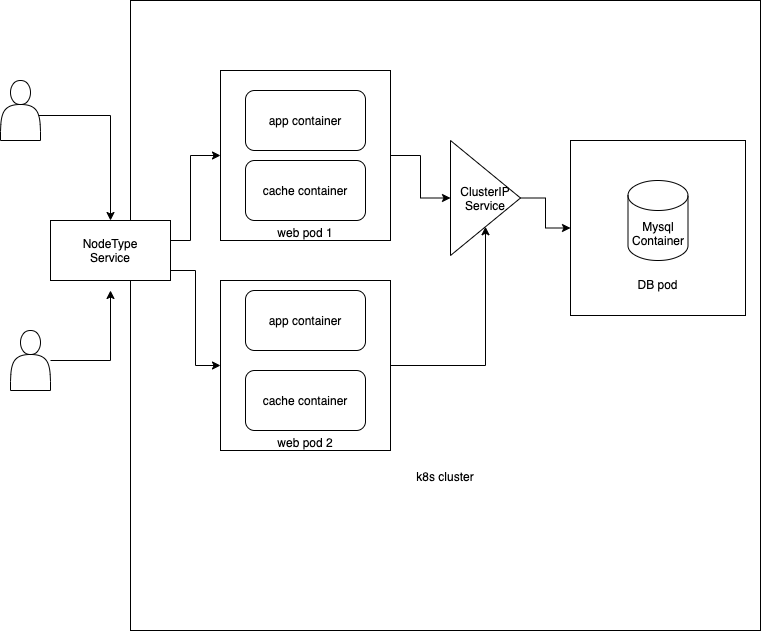

# Application and Architecture

------------------------------
Deploys a simple blog post app with multi-container pod with app+cache containers.
A DB pod serves as data store
App written in python, basic blog post that sets and gets values.
Values are served from cache when request reaches a pod, cache contents expires after 10s.
RC ensures replicas of pods work together to server a Service.

Connections
-----------
1) app container and redis container shares networking and can talk to each other over localhost.
2) mysql is exposed as a service and Service Discovery happens with DNS. All pod, service are in same namespace and service is resolvable to host/port from pod.
3) App is exposed as a NodePort accessible with Node's private IP or Node's public IP subjected to firewall rule placement.

Blockers
----------
- Running flask on localhost stopped app acceessibilty over ClusterIP:port or NodeIP:NodePort,redeployed app over 0.0.0.0.
- docker image, doesn't update contents of file changed on disk when updated to same tagName each time. Fix is to run docker build with --no-cache option and  to delete
  existing images in minikube node.
  
  *$ minikube ssh*
  *$ docker rmi <image-id>*

